## 1. 这是一个什么插件？
可以在代码中实时看到Apollo配置的值的插件
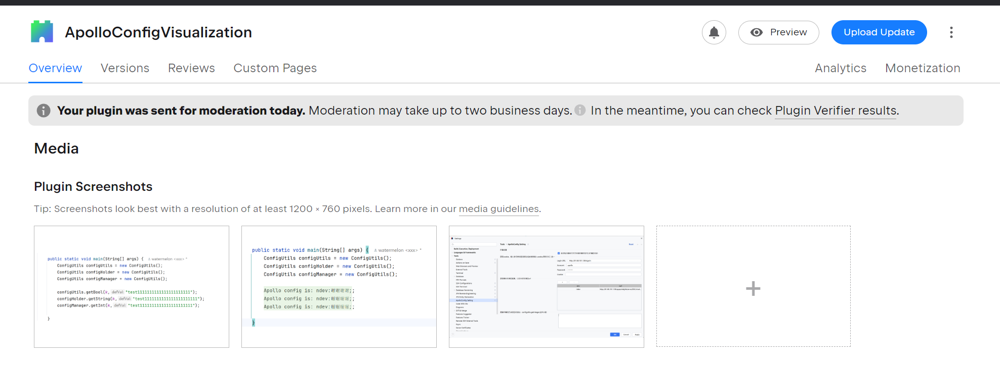

## 2. 插件如何使用？

### 下载
在idea插件市场搜索
```js
ApolloConfigVisualization
```
即可下载
### 配置
Settings->Tools->ApolloConfig Setting
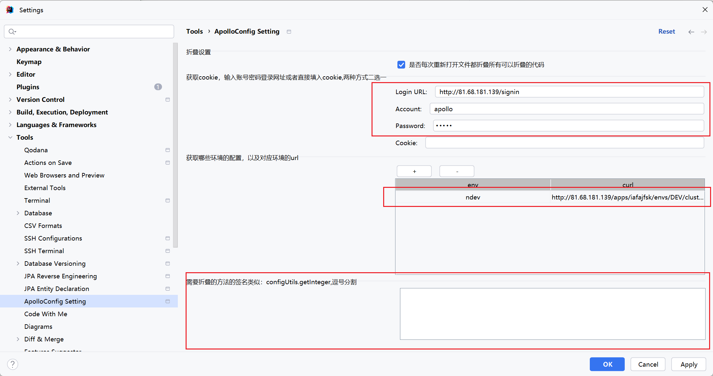

#### 1. 登录地址、账号、密码 （也可以直接填cookie，但是cookie 会过期）
#### 2. 填环境 以及对应获取配置的URL
环境仅是描述，URL是实际获取配置的URL，类似：
```js
http://81.68.181.139/apps/iafajfsk/envs/DEV/clusters/default/namespaces
```
#### 3. 获取Apollo配置的方法的签名，类似configUtils.getInteger
默认支持下面这，如果有自定义的可以配置在配置里
```json
[
    "configUtils.getBool",
    "configUtils.getBoolean",
    "configUtils.getInt",
    "configUtils.getLong",
    "configUtils.getInteger",
    "configUtils.getString",
    "configHolder.getBool",
    "configHolder.getBoolean",
    "configHolder.getInt",
    "configHolder.getLong",
    "configHolder.getInteger",
    "configHolder.getString",
    "configManager.getBool",
    "configManager.getBoolean",
    "configManager.getInt",
    "configManager.getLong",
    "configManager.getInteger",
    "configManager.getString"
]
```
#### 4. 配置好后点击一下刷新按钮获取这个应用的所有配置项
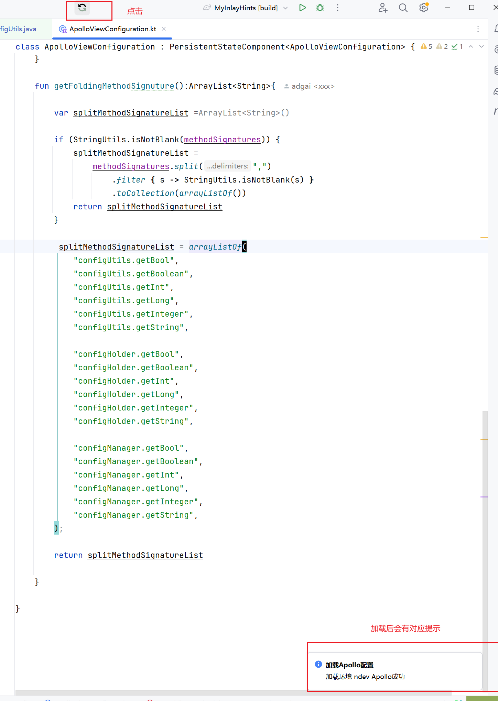
#### 5. 打开有上面调用方法签名的文件就会看到key对应在Apollo的配置
如果在Apollo中没有配置对应的key，就会展示调用方法时传入的默认值，类似这样：

代码：
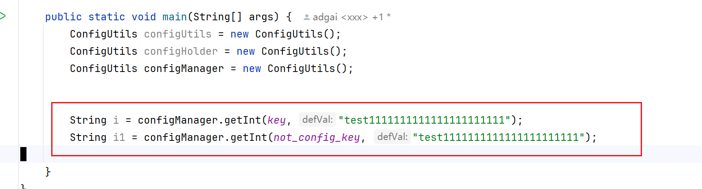
其中key在Apollo中配置为：谢谢；not_config_key在Apollo中没有配置

插件折叠后的效果：
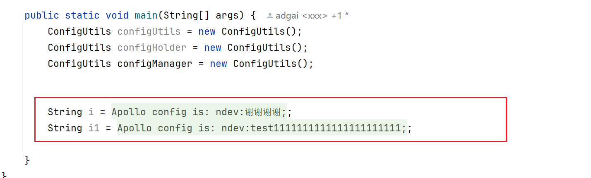
有配置的key展示Apollo配置的值，没有配置的key展示调用方法时传入的默认值

## 3. 插件相关介绍
### 为什么会有这个插件：因为需要在看代码的时候看到Apollo中配置的值
在某些情况会使用类似工具类获取Apollo的配置，像这样（下面图是个例子，实际生产是类似的情况）：

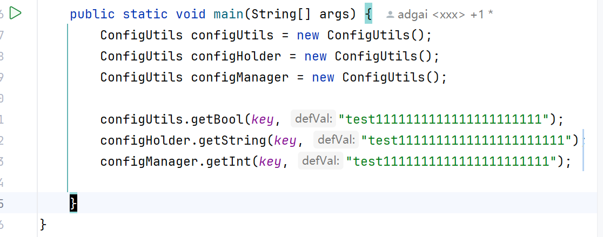

如果需要知道key配置的值，需要到Apollo的网页端查看，类似这样：

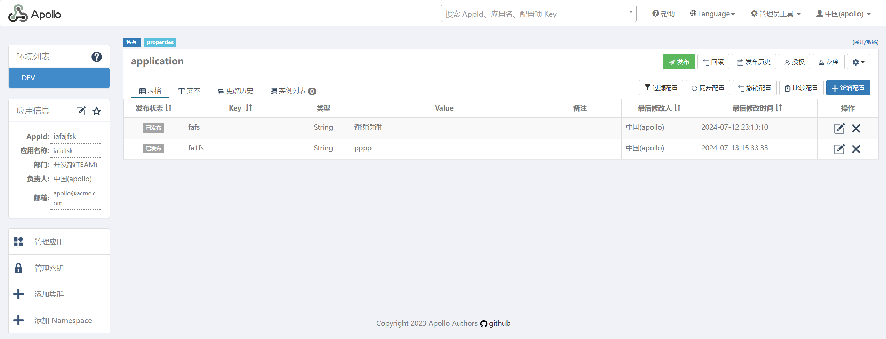

这样很不方便，尤其是某些项目会在Apollo中配置大量开关，

在排查问题时需要频繁查看某个key的value是什么，

这会频繁打断看代码的节奏，因此迫切需要能在看代码时直接看到key对应的value是什么。

类似这样的效果：

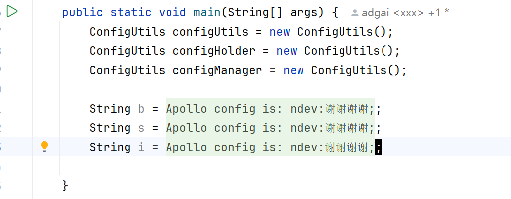

这样就可以在代码中直接看到相应key在Apollo中配置的值

### 这种效果是什么？在Intellij idea中如何实现？
在Intellij idea中这种效果称为“folding”,可以使用
```js
ctrl -
```
```js
ctrl +
```
来展开或者折叠

但是在Intellij idea中, 每次都需要手动折叠，我需要一种效果，在我需要编辑上面的代码的时候展开炸折叠的代码，
编辑完后，关闭文件，下次再重新打开文件时，
相应的代码会自动折叠

### 如何从Apollo获取配置？如何保证获取配置不影响线上？
#### 可以如何从Apollo获取配置？

| 方式                            | 优点                | 缺点                                                     |
|:------------------------------|:------------------|:-------------------------------------------------------|
| 使用Apollo开放api                 |  简单高效             | 1. 需要相关token <br/> 2. 没有本地缓存能力，需要自己实现<br/>3. 无法感知到配置变更 |
| 像spring boot项目集成Apollo client | 有本地缓存机制，配置变更能感知到  | 不好集成，Apollo client需要很多配置，需要mock环境，很复杂                  |
| 使用Apollo 网页的api               | 简单高效，可以简单实现本地缓存机制 | 无法感知到配置变更，需要手动刷新                                       |


#### 如何不影响线上？
一定程度上下面两种方式都不会影响线上
#### 插件是使用哪种方式实现的，以及一些具体细节

使用
```js
使用Apollo 网页的api  
```
这种方式

细节 ：
通过Apollo 网页的api或者应用在某个环境的全部配置，存在Intellij idea 的配置文件中，需要读取配置的时候从配置文件中读

##### 1. 获取应用在某个环境中的全部配置
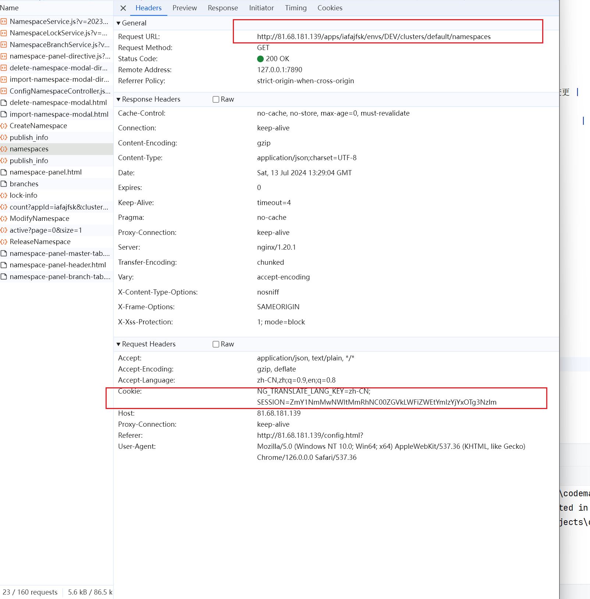
请求这个URL，需要带有一个cookie，cookie是登录Apollo 后拿到的
##### 2. 拿cookie
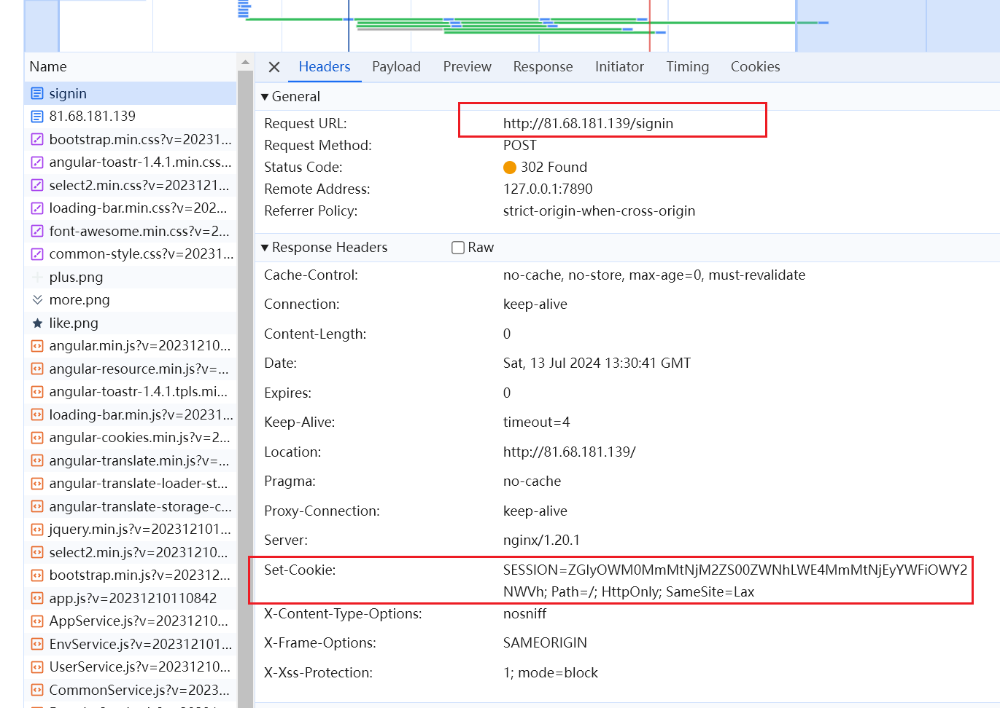


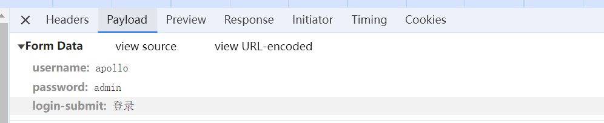
使用账号密码请求上面的接口 就可以拿到cookie，进而请求第一步的接口，拿到所有配置

##### 3. 拿到所有配置后缓存在Intellij idea的配置文件中
这样来实现本地缓存，避免多次请求
##### 4. 配置变更了怎么办？
这个问题具体一点就是线上配置变更了怎么办，无法感知到，
所以增加了一个刷新按钮，在每次需要基于线上的配置读代码的时候就可以刷新一下

这种刷新行为和用户打开网页看是一样的，所以对线上也没有影响
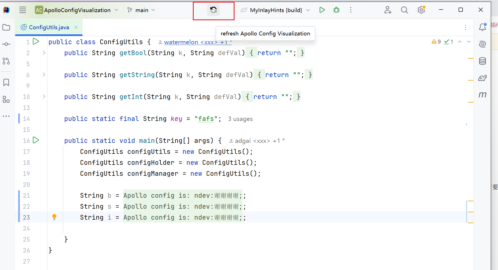

