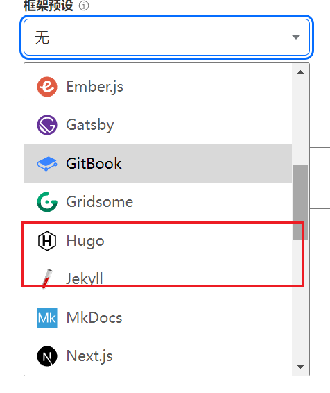
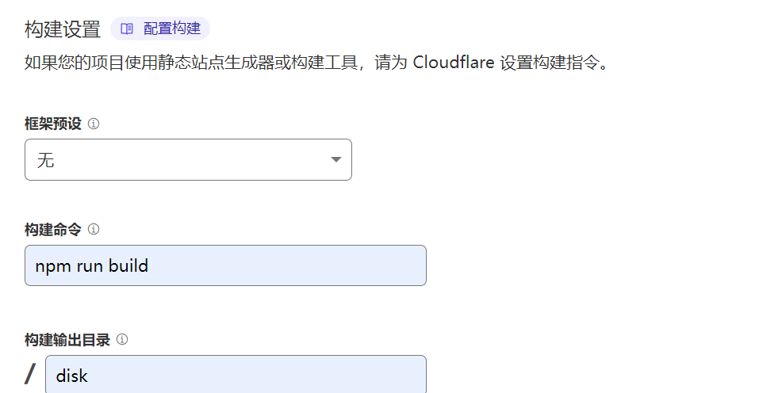
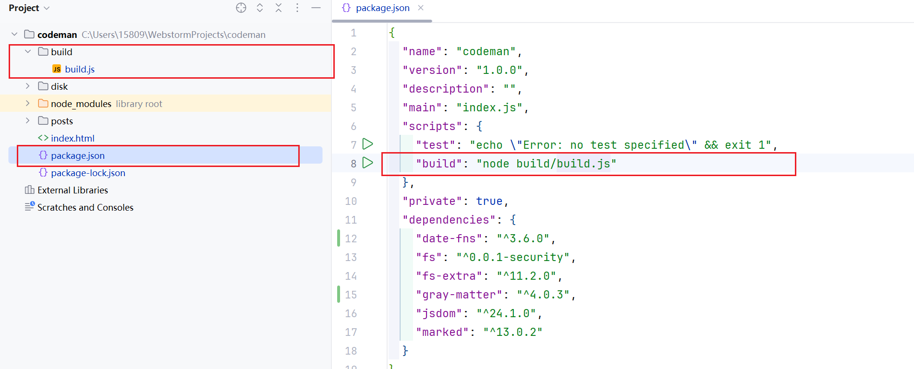
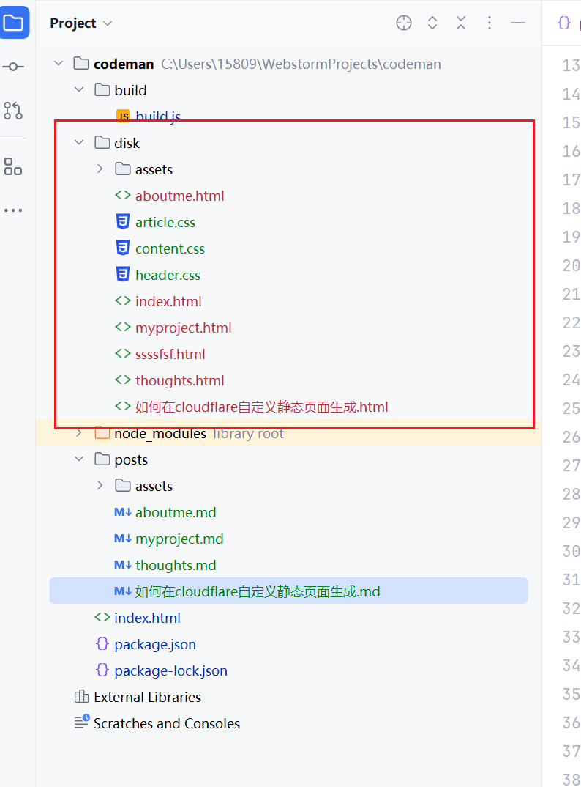

## cloudflare 支持哪些静态网页生成？


## 为什么不直接使用默认支持的框架？

默认框架使用起来比较繁琐，我只需要一个能把markdown转成HTML的简单框架即可。
同时默认框架对自定义主题这方面，对于我一个新手来说比较繁琐。

因此我决定自己做一个简单的框架

## 如何在cloud flare上使用自定义的框架？


只需要三步
1. 不使用框架
2. 输入构建命令
3. 输入构建输出目录

### 那自定义的框架应该是怎么样的？

#### 框架构建


建一个项目，package.json中 增加一条build的script，
命令是
``` js
node build/build.js
```
即执行项目目录下build文件夹中的build.js
#### 构建输出结果

即上面build.js将生成的静态文件放到项目哪个文件夹里，我这里是放到了项目根目录下的
disk文件夹中



### 如何在cloud flare上部署

除了上面的设置，和使用其他框架部署是一样的
